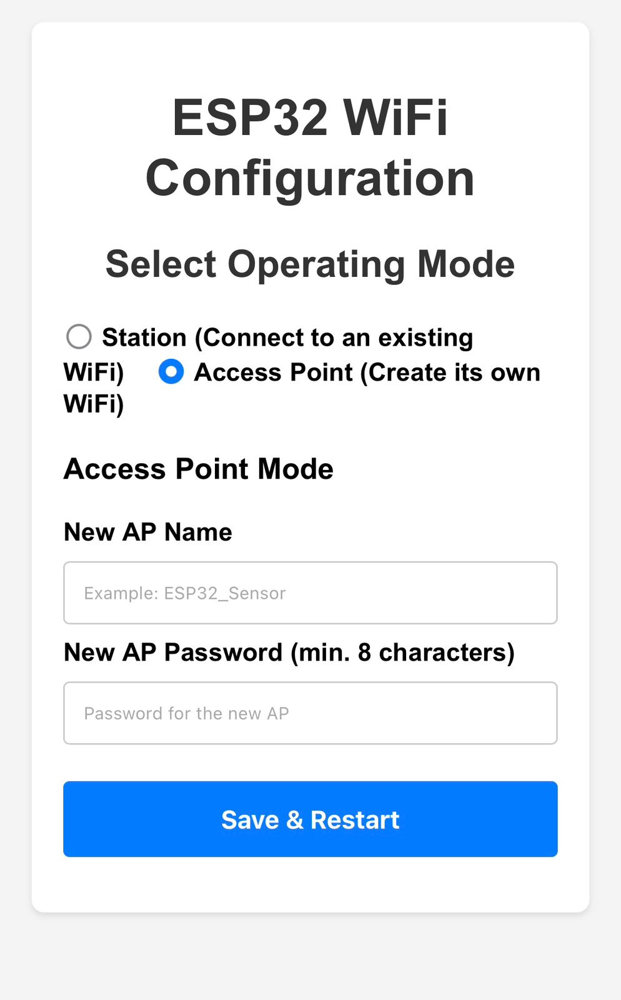
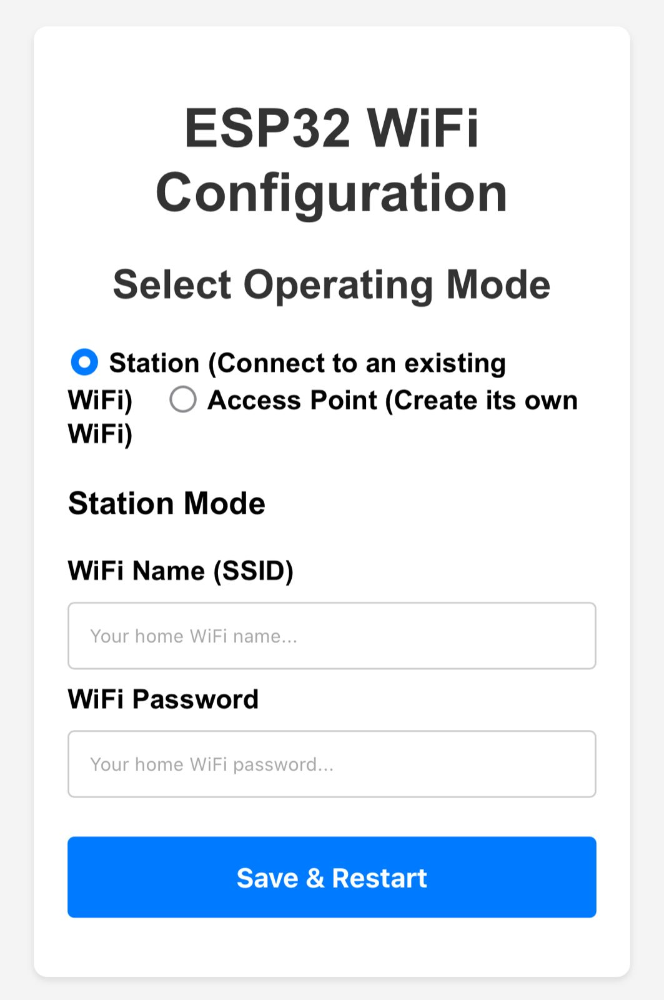

<h1>ESP32 WiFi Configuration Manager</h1>
A robust and user-friendly Arduino library for the ESP32 to manage WiFi connections. It provides a non-blocking web portal for on-the-fly configuration, allowing you to change WiFi credentials and operating modes without needing to re-flash the device.

The entire process runs as an independent task on a separate core, ensuring your main application code remains responsive and free from network-related delays.

  

  
  

  <h2>Key Features</h2><ul><li>
<strong>Web-Based Configuration:</strong> No more hard-coded WiFi credentials. Configure everything from a web browser on your phone or laptop.
</li><li>
<strong>Dual Mode Operation:</strong> Easily switch between:
<ul><li>
<strong>Station (STA) Mode:</strong> Connect the ESP32 to an existing WiFi network.
</li><li>
<strong>Access Point (AP) Mode:</strong> The ESP32 creates its own WiFi network for other devices to connect to.
</li></ul></li><li>
<strong>Persistent Storage:</strong> All settings (mode, SSID, password) are saved permanently to the ESP32's non-volatile flash memory using the <code>Preferences</code> library.
</li><li>
<strong>Truly Non-Blocking:</strong> The entire WiFi connection and web server logic runs as a dedicated FreeRTOS task on a separate core. Your <code>loop()</code> function is never blocked.
</li><li>
<strong>Manual Reconfiguration Trigger:</strong> You can force the device into configuration mode at any time by simply holding down the onboard <strong>BOOT</strong> button for a few seconds.
</li><li>
<strong>Automatic Captive Portal:</strong> When in configuration mode, connecting to the ESP32's network will automatically open the configuration page on most devices.
</li></ul><h2>How to Use</h2>
The library is designed to be extremely simple to integrate into your projects.
<pre><code>#include "WiFiConfigManager.h"

// Create an instance of the manager
WiFiConfigManager wifiManager;

// Pin for the manual trigger (GPIO 0 is the BOOT button)
const int TRIGGER_PIN = 0;

void setup() {
  Serial.begin(115200);
  pinMode(TRIGGER_PIN, INPUT_PULLUP);

  // This single function starts the WiFi manager in the background on Core 0.
  // It will attempt to connect using saved credentials. If it fails,
  // it will automatically start the configuration portal.
  wifiManager.beginAndRunInBackground(0);
}

void loop() {
  // Your main application code runs here on Core 1, completely
  // unaffected by the WiFi management task.

  // You can check the button to manually enter config mode
  if (digitalRead(TRIGGER_PIN) == LOW) {
    // Logic to detect a long press...
    // If pressed long enough:
    // wifiManager.startConfigPortalBlocking();
  }

  // Example: Print status
  if(WiFi.status() == WL_CONNECTED) {
    // Do something when connected
  }

  delay(1000);
}
 </code></pre><h2>The Configuration Process</h2><ol><li>
<strong>First Boot / Failed Connection:</strong> If the ESP32 has no saved credentials or fails to connect, it will create its own WiFi network (e.g., <code>"ESP32-Setup"</code>).
</li><li>
<strong>Connect to the Portal:</strong> Use your phone or laptop to connect to this new WiFi network.
</li><li>
<strong>Automatic Redirect:</strong> A captive portal should automatically open the configuration page in your browser. If not, open a browser and navigate to any address (e.g., <code>192.168.4.1</code>).
</li><li>
<strong>Configure &amp; Save:</strong> Choose the desired mode (Station or AP), enter the credentials, and click "Save &amp; Restart".
</li><li>
<strong>Restart &amp; Run:</strong> The ESP32 will save the configuration and restart. It will then automatically operate in the mode you selected.
</li></ol>

